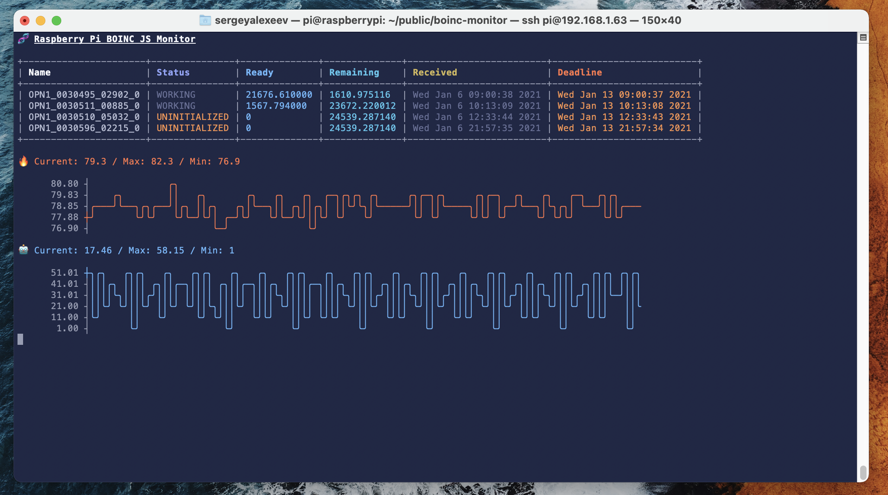

# Raspberry Pi BOINC JS Monitor

## About

Get current BOINC tasks, CPU load, and temperature in your command line.



## Installation

```
// using npm
npm i pi-boinc-monitor -g
// or yarn
yarn global add pi-boinc-monitor
```

## Run

```
pi-boinc-monitor
```

## Using

* 🔥 - temperature
* 🤖 - CPU load

## Need Help

If you need any help, please contact me via GitHub issues page: [GitHub](https://github.com/monosux/raspberry-pi-boinc-js-monitor/issues)